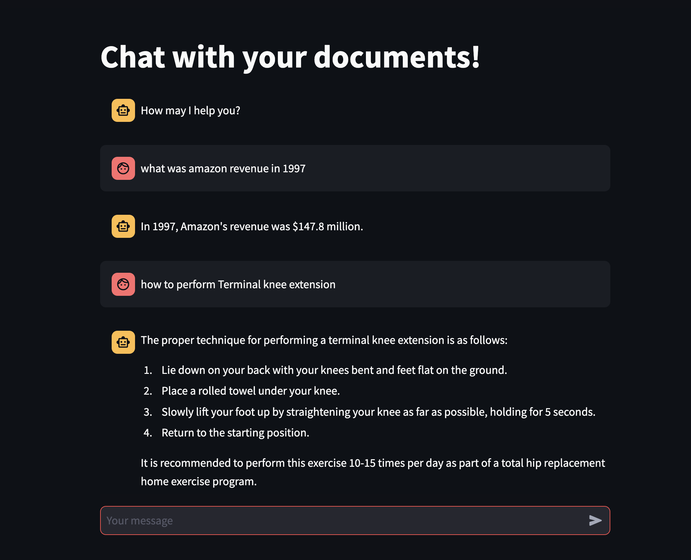

# rag-llm
rag+llm
This repo implements RAG using :
1. BAAI Embeddings(BAAI/bge-large-en-v1.5) - Locally deployed on ec2. Embedding size is 1024
2. Mistral: Open source model :https://huggingface.co/TheBloke/Mistral-7B-Instruct-v0.1-GGUF - This is quantized model.
3. llama-index: For creating document index and act as data orchestration framework.
4. Chroma-dd as vector store.
5. Streamlit for Chatbot interface.

Data used :
1. White paper - Attention is all you need.
2. Home Exercise recommendation after Hip replacement
3. Amazon 2022 financial report.

To run on EC2 :

1. pip install -r requirements.txt 

2.Run following commands from terminal  
  export HF_SENTENCE_TRANSFORMER_LOCAL_DIR={directory location of embedding model}
  export LLM_LOCAL_PATH={directory location of llm}
  export HF_SENTENCE_EMBEDDER_DEVICE= cpu or gpu (gpu if your instance has gpu)

3. Download Mistral from :
   https://huggingface.co/TheBloke/Mistral-7B-Instruct-v0.1-GGUF/resolve/main/mistral-7b-instruct-v0.1.Q4_K_M.gguf

4.Download BGE large english embedding model:
  https://huggingface.co/BAAI/bge-large-en-v1.5

We recommended that you use g5 instance series on aws to test this setup.
  
Look and feel:

